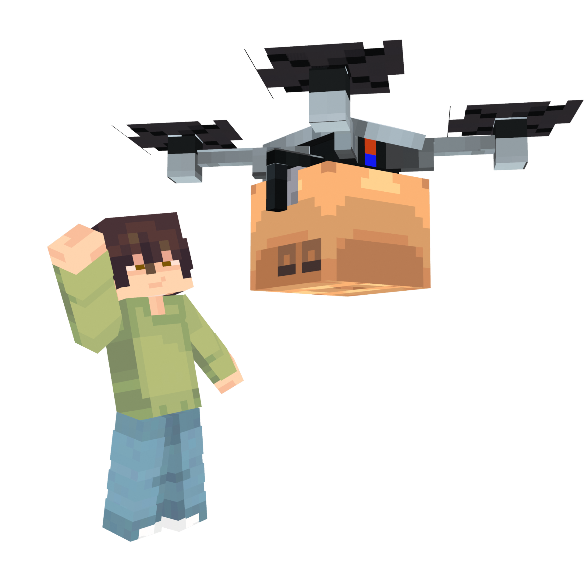
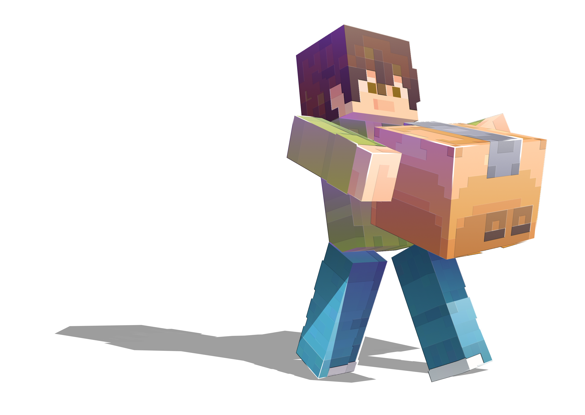
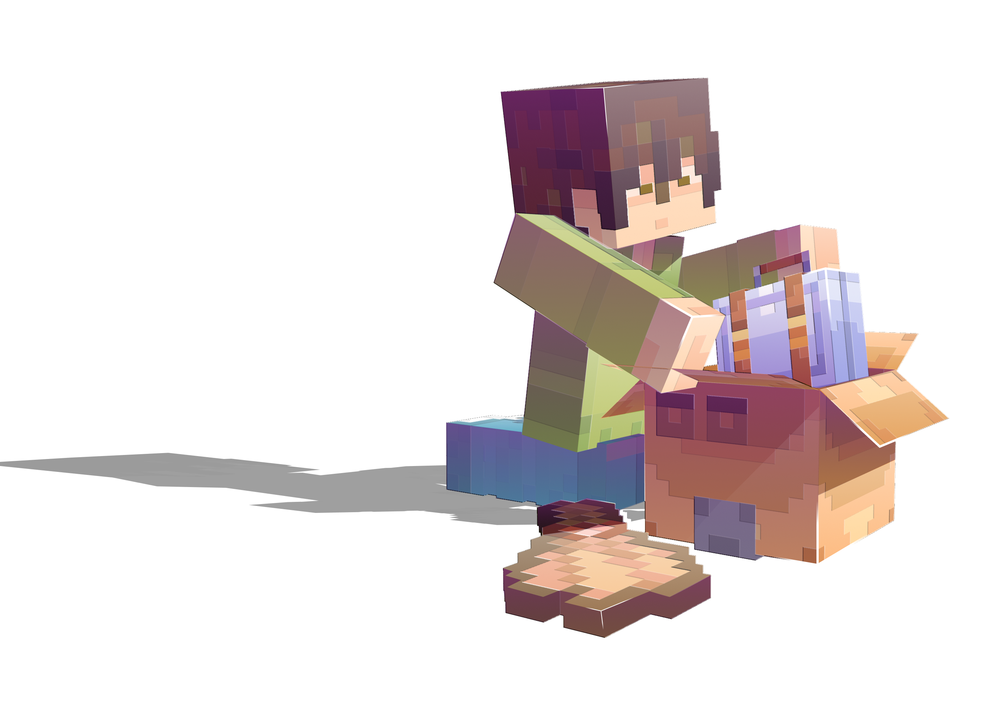
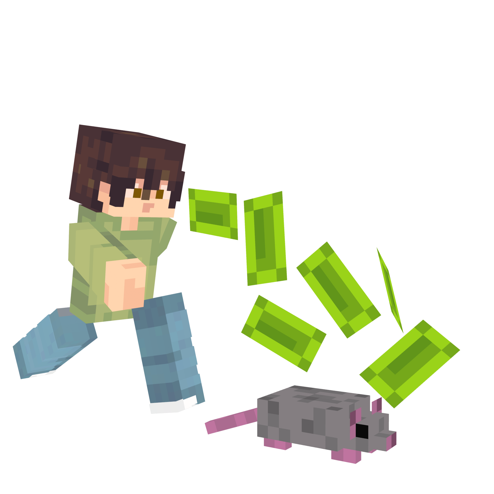
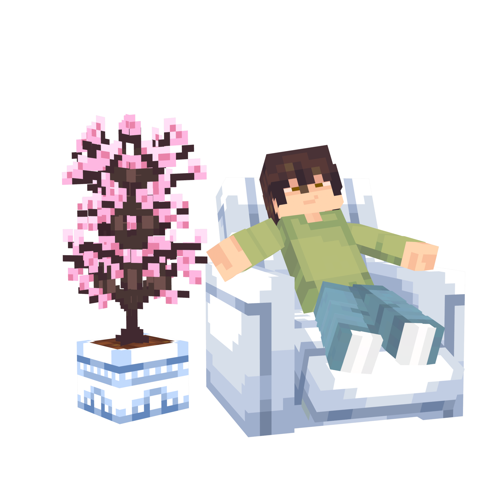
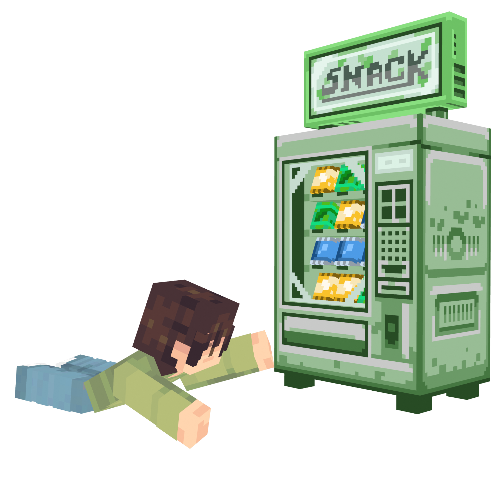

<div align="center">



# 🧹 Clean The Backyard

**An idle-clicker cleaning game for Paper 1.21**

*Break cardboard boxes. Hire drones. Build your home. Fend off thieving rats.*

[](https://papermc.io/)
[](https://adoptium.net/)
[](#)
[](https://github.com/Multiverse/Multiverse-Core)

</div>

---

## 📦 What is Clean The Backyard?

**Clean The Backyard** is a progression-driven idle game built on top of Paper.
Each player gets their own private world cloned from a template, where the loop
is simple but deeply upgradeable: **break boxes, fill your bag, sell, upgrade, repeat.**

Behind that loop sits a full economy of upgrades, automation drones, random
world events, daily quests, prestige, collectible hunting, and a personal
house you decorate with furniture.

<div align="center">

</div>

---

## ✨ Features

### 🗃️ The Core Loop
Break cardboard boxes (vanilla blocks **or** ItemsAdder custom blocks), fill
your bag up to its capacity, then walk into the **sell zone** to cash out.
Every box costs energy — manage it, or fall into fatigue.

### ⚙️ Deep Upgrade Trees
- **Bag** — 15 capacity tiers, from 10 to 50,000 boxes
- **Tool** — faster cooldowns, multi-box collection, and bonus-box chances
- **Energy** — bigger reserves and faster regeneration

### 🤖 Automation Drones
Buy assistant drones that fly around your world, collect boxes, and sell them
for you. Six drone types from **Basic** to **Stellar**, each with three
upgrade tracks: **Speed**, **Range**, and **Income**.

<div align="center">

</div>

### 💎 Collectibles & Cleaning Mini-Game
Some boxes hide rare items — vintage cassettes, Game Boys, golden statues.
They drop **dirty**, and you clean them through a timing-based mini-game before
displaying them on your **collection board**. Five rarities, five difficulty levels.

### 🎲 Random World Events
- **🛸 UFO** — break special crates for buffs; hit the global quota for a server-wide x2 sell bonus
- **✦ Golden Drone** — chase a fleeing drone and strike it for a big payout
- **🌧️ Box Rain** — boxes fall from the sky across a defined region
- **🖤 Black Market** — x3 sell value for everyone, for a limited time

### 🐀 Rats & Security
Thieving rats spawn near your stash and try to steal a slice of your balance.
Defend with **security cameras** (detection) and **traps** (elimination) — or
just punch them yourself.

<div align="center">

</div>

### 🏠 Personal House
Each player unlocks a private house world cloned from a template. Buy furniture
from the in-house shop, stock it, and place it freely to decorate your space.

<div align="center">

</div>

### 🥤 Vending Machine
Out of energy? Grab a soda, a coffee, or an energy drink to top up and keep going.

<div align="center">

</div>

### 📜 More Systems
- **Daily quests** — three rotating objectives that reset at midnight
- **Prestige** — reset progression for permanent gain multipliers (+10% per level, up to 50)
- **Live HUD** — balance, bag, energy, and active buffs in the action bar
- **Session-aware energy regen** — full energy in the hub, gradual regen in your world

---

## 🔧 Requirements

| Dependency | Status | Purpose |
|------------|--------|---------|
| **Paper 1.21** | Required | Server platform |
| **Java 21** | Required | Runtime |
| **Multiverse-Core 5.7+** | Required | Per-player world cloning |
| **ItemsAdder** | Optional | Custom box blocks, furniture & collectibles |
| **MythicMobs** | Optional | Custom drone & rat entities |
| **ModelEngine** | Optional | Entity models |

> Without ItemsAdder / MythicMobs the plugin falls back gracefully to vanilla
> blocks and mobs — nothing breaks.

---

## 🚀 Installation

1. Drop `CleanTheBackyard.jar` into your server's `plugins/` folder.
2. Install **Multiverse-Core** (required).
3. *(Optional)* Install ItemsAdder, MythicMobs and ModelEngine for the full experience.
4. Start the server once to generate `config.yml`.
5. Create your hub, template, and house-template worlds, then set their spawns.
6. Run `/ctb reload` after any config change.

---

## 🎮 Commands

### Player

| Command | Description |
|---------|-------------|
| `/create` | Create your personal world |
| `/go` | Travel to your world |
| `/spawn` | Return to the hub |

### Admin (`ctb.admin`)

| Command | Description |
|---------|-------------|
| `/ctb stats [player]` | View full player stats |
| `/ctb money <give\|set\|take> <player> <amount>` | Manage balances |
| `/ctb level <bag\|tool\|energy> <player> <level>` | Set upgrade levels |
| `/ctb drone <give\|remove> <player> <key>` | Manage drones |
| `/ctb buff <type> <player> <seconds>` | Apply temporary buffs |
| `/ctb event <drone\|ufo\|boxrain\|blackmarket>` | Trigger events |
| `/ctb prestige <set\|add> <player> <level>` | Manage prestige |
| `/ctb collectible <give\|giveclean> <player> <key>` | Spawn collectibles |
| `/ctb furniture <give\|stock> <player> <key>` | Manage furniture |
| `/ctb house <tp\|create> <player>` | Manage player houses |
| `/ctb reload` | Reload configuration |

Admin spawn setup: `/setspawn` (hub) and `/setplayerspawn` (template world).

---

## ⚙️ Configuration

Everything is tuned from `config.yml`:

- **Worlds & spawns** — hub, templates, world prefixes
- **Interaction zones** — garage, shop, sell zone, quest board, prestige altar…
- **Upgrade tables** — bag, tool, energy (15 tiers each)
- **Drone catalogue** — stats, costs, prerequisites
- **Event timing** — min/max windows for every random event
- **Rats & security** — spawn rates, steal %, camera/trap upgrades
- **Collectibles** — drop chances, rarities, cleaning difficulty
- **Furniture shop** — items, prices, icons

Block & entity references support both vanilla and custom syntax:

```yaml
box-block: "itemsadder:example:carton_block"   # or "vanilla:NOTE_BLOCK"
golden-drone-entity: "mythic:float_donut"       # or "vanilla:BAT"
```
🗺️ Roadmap
 Unlockable & resizable box zones
 Trash bag visible in hand when carrying boxes
 Lobby with multi-profile / co-op instances
 Session multiplier (+1% per minute played)
 Critical "golden" boxes (x10 value)
 Talent tree per prestige point
 Drone skins via milestones
 Rare box collection & museum
 14-day seasons with a free battle pass
 Daily reward streaks & achievements
 Offline production (sleep mode)
 Drone specialization modules
 Custom-texture GUIs & BetterHUD integration
Made with 🧹 by 
TitouanLeGrall
